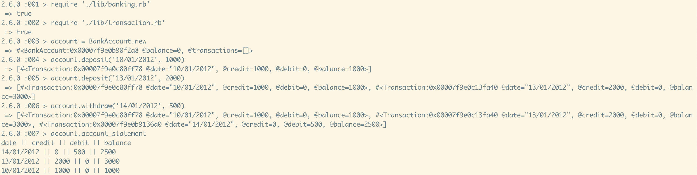

# Bank Account Tech Test :moneybag:

Create a banking app, which has the following features:

* A client makes a deposit of 1000 on 10-01-2012
* And a deposit of 2000 on 13-01-2012
* And a withdrawal of 500 on 14-01-2012

When the client prints the bank statement, it will display:

```
date || credit || debit || balance
14/01/2012 || 0 || 500.00 || 2500.00
13/01/2012 || 2000.00 || 0 || 3000.00
10/01/2012 || 1000.00 || 0 || 1000.00
```
### Technologies
* Ruby
* RSpec
* SimpeCov
* Rubocop

### Instructions
Clone the repo and run `bundle install`. For running the tests, open the command line and run `rspec`. It will also show the coverage of the tests. 

* For feature testing, open IRB and type in:
```
$  require './lib/banking.rb'
$  require './lib/transaction.rb'
$  account = BankAccount.new
```
* For crediting the account:
```
$  account.deposit('30/06/2019', 1000)
```

* For debiting the account:
```
$  account.withdraw('01/07/2019', 500)
```

* For displaying the statement
```
$  account.account_statement
```

### Photos


### Quality of code
* 100% test coverage
* Rubocop linter passes
* All tests passing
* Commits are regular, have good descriptions
